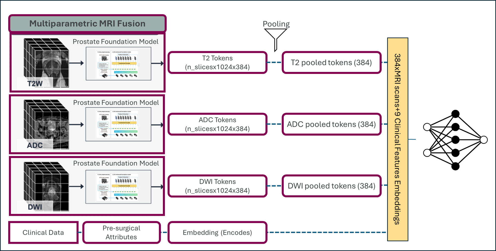

# ProctateBCR-Prediction-CHIMERA


# ProctateBCR-Prediction-CHIMERA
**Multimodal model for BCR Prediction in Prostate Cancer **  

## Overview  
This is a BCR prostate cancer risk model designed for integrating information from three MRI modalities (T2, ADC, DWI) and patient clinical data within a unified pipeline. Each MRI scan of a patient is forwarded to a prostate-specific foundational model, ProViCNet (https://doi.org/10.48550/arXiv.2502.00366) ​, which acts as a modality-specific feature extraction backbone, producing tokenized embeddings with a shared dimensionality. These tokenized modality representations are treated as independent tokens and pooled across patches within each modality to form patient-level embedding’s. 




## Installation
Before installing dependencies, install PyTorch based on your system configuration.

```bash
# Clone the repository
git clone https://github.com/BanafsheFe/ProctateBCR-Prediction-CHIMERA.git
cd ProctateBCR

# Create a conda environment
conda create -n ProctateBCR python=3.10
conda activate ProctateBCR

# Install required packages
pip install -r requirements.txt
```

## ProctateBCR prediction


## Acknowledgement
Thanks to the https://github.com/lucidrains/byol-pytorch for ProViCNet implement.<br>(https://github.com/pimed/ProViCNet)
 **Reference**: Lee, Jeong Hoon, et al. "Prostate-specific foundation models for enhanced detection of clinically significant cancer." arXiv preprint arXiv:2502.00366 (2025).
- DINOv2 team for the vision transformer backbone
